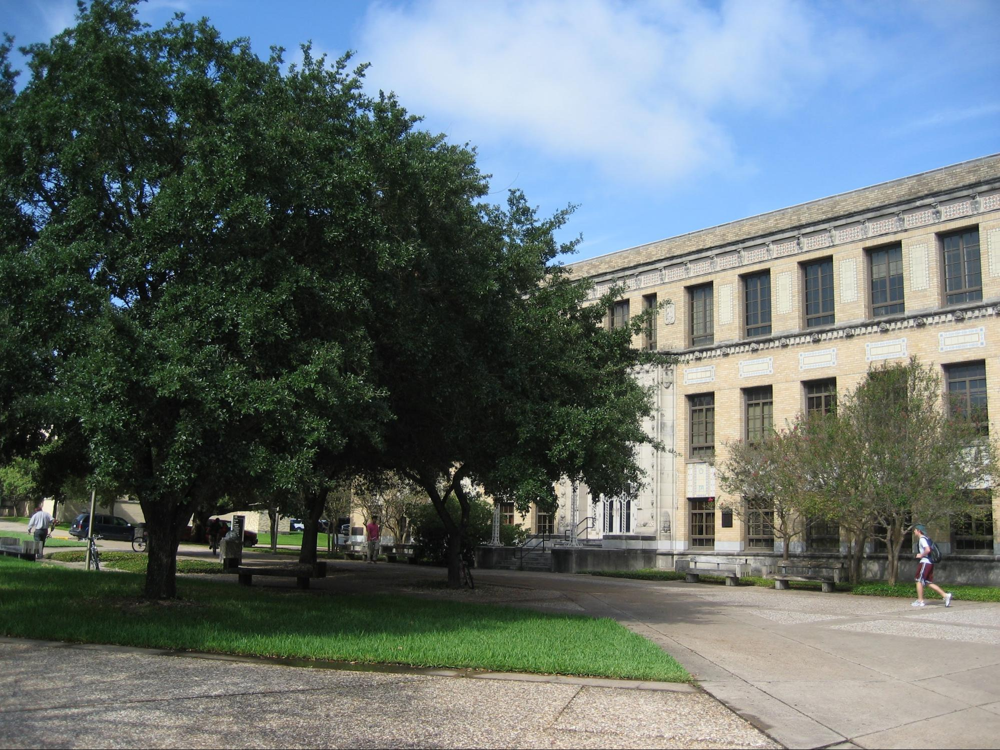
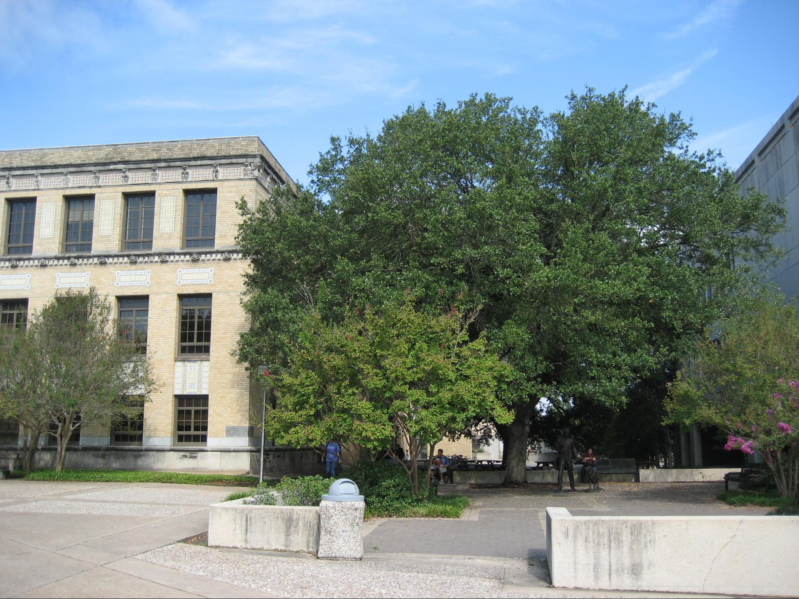
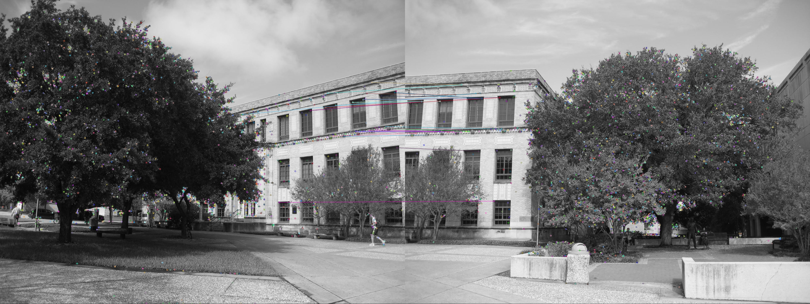
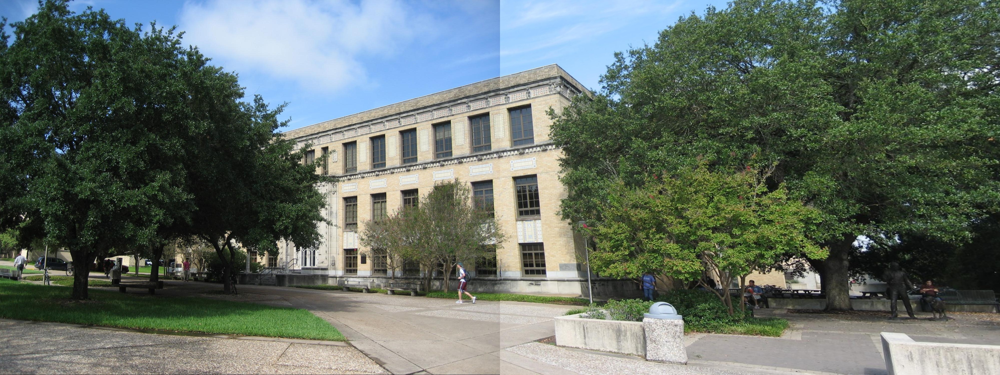

## Panorma Photo

### Introduction
Two images are taken in the same position before and after a camera rotation. How do we stitch or merge these images into one image? The goal of the project is to create a photo with panoramic view.




---

### Implementation
#### Step 1: find corresponding features
The corresponding features are regarded as landmarks, and we could use these features to estimate camera poses. Here, we adopt SIFT, Scale-Invariant Feature Transform, to compare the corresponding features in two photos. SIFT algorithm can find distinct key-points in the image. In the image below, two key-points that connected by a line are the corresponding features. We can find that most of the corresponding features are distributed between the small tree and the right-hand-side of the building.




#### Step 2: calculate the homography matrix
When camera rotates, the relationship between the first image and the second image is a projective transformation. The homography matrix (a 3x3 matrix) is a linear mapping from the points in the first image to the points in the second image. We use the coordinates of the corresponding features to calculate the homography matrix. This method is called Direct Linear Transformation (DLT) algorithm. I implemented the DLT algorithm in C++, and you could refer to my source code for more details. In OpenCV, you could simply call the function, [findHomography()](https://docs.opencv.org/2.4/modules/calib3d/doc/camera_calibration_and_3d_reconstruction.html?highlight=calib#findhomography), to compute the homography matrix.


#### Step 3: project points on an image
After finding the homography matrix, we could map all the points in the second image to the first image. We use the OpenCV function, [wrapPerspective()](https://docs.opencv.org/2.4/modules/imgproc/doc/geometric_transformations.html#warpperspective) , to fulfill the mapping computation. Finally, we create an panoramic photo as the image below.



---

### Mathematic Induction
- [Please refer to this link for the full details.](./images/web_proj4.pdf)

### My Source Code
* matcher.cpp
  * The program use SIFT algorithm to find key-points and compare the key-points between two images.

* proj2q1.cpp
  * The program use the DLT algorithm to create a panoramic photo.

* proj2q2.cpp
  * The program use the normalized DLT algorithm to find the homography matrix. The normalized DLT algorithm lower the noises of input points and achieve a better result than the DLT algorithm.


### How to compile c++ file that include OpenCV library?
 ``` g++ -ggdb matcher.cpp -o matcher `pkg-config --cflags --libs opencv` ```

